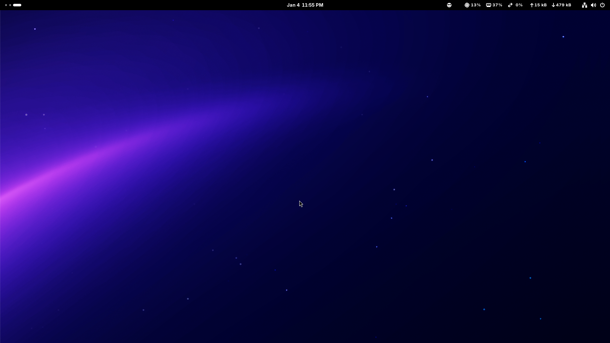
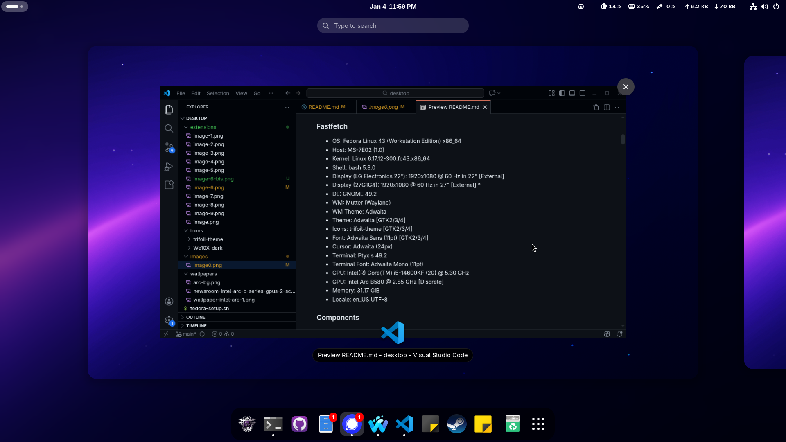
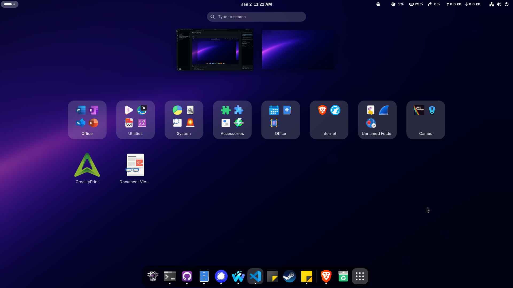
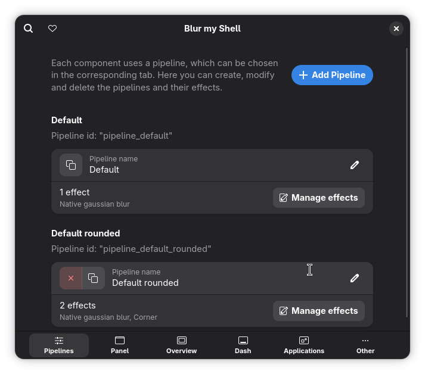
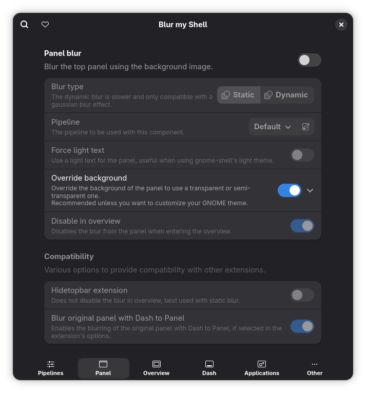
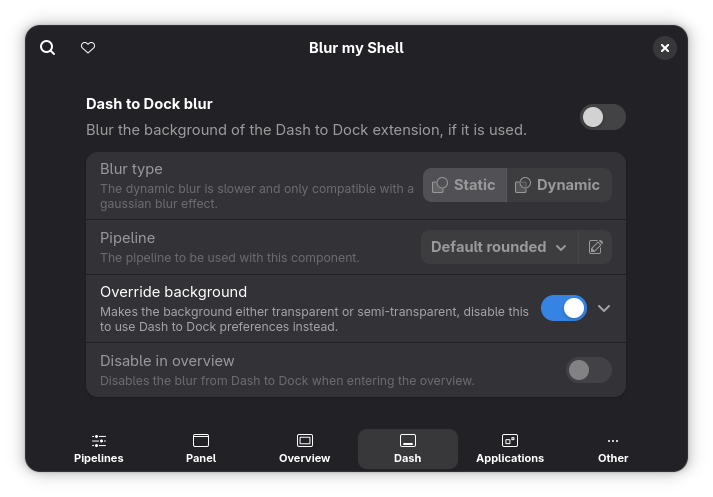
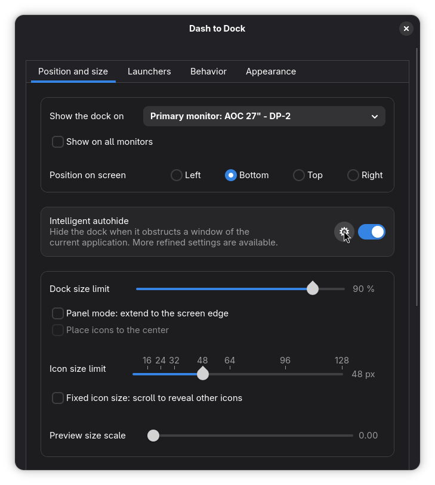

# Fedora desktop

Fedora 43 desktop setup 

## Gallery







## Description

### Fastfetch

* OS: Fedora Linux 43 (Workstation Edition) x86_64
* Host: MS-7E02 (1.0)
* Kernel: Linux 6.17.12-300.fc43.x86_64
* Shell: bash 5.3.0
* Display (LG Electronics 22"): 1920x1080 @ 60 Hz in 22" [External]
* Display (27G1G4): 1920x1080 @ 60 Hz in 27" [External] *
* DE: GNOME 49.2
* WM: Mutter (Wayland)
* WM Theme: Adwaita
* Theme: Adwaita [GTK2/3/4]
* Icons: trifoil-theme [GTK2/3/4]
* Font: Adwaita Sans (11pt) [GTK2/3/4]
* Cursor: Adwaita (24px)
* Terminal: Ptyxis 49.2
* Terminal Font: Adwaita Mono (11pt)
* CPU: Intel(R) Core(TM) i5-14600KF (20) @ 5.30 GHz
* GPU: Intel Arc B580 @ 2.85 GHz [Discrete]
* Memory: 31.17 GiB
* Locale: en_US.UTF-8

### Components

* MSI PRO B760M-P DDR4
* WD Red SN700 2000GB (112000WD)
* TEXTORM BM5 240GB (T0910A0)
* Intel Core i5-14600KF
* Be quiet! PURE ROCK 3 Black
* LDLC GT-550P ATX
* CORSAIR VENGEANCE C70 Gunmetal Black 
* G.Skill Value 32 Go (4x 8 Go) DDR4 2133 MHz CL15 

## Instructions

### Icons

The icon pack should be placed in ```~/.icons```.

### Intel ARC GPU fix

For the GPU to work correctly without artefacts in Fedora 43 Gnome applications, change the gsk renderer to gl (so that native GTK apps are rendered through gl and not vulkan).

in the ```~/.bashrc```, add the line ```export GSK_RENDERER=gl```.

### Extensions

* Blur my shell     
* Caffeine      
* Dash to Dock
* Emoji Copy
* Removable Drive Menu
* System Monitor
* User Themes

### Extensions conf

* Blur my shell     
    
    
    
    
    
    
* Caffeine      
    * Default settings
* Dash to Dock      
    
    
    
    
* Emoji Copy        
    * Default settings
* Removable Drive Menu      
    * Default settings
* System Monitor        
    * Default settings
* User Themes       
    * Default settings
